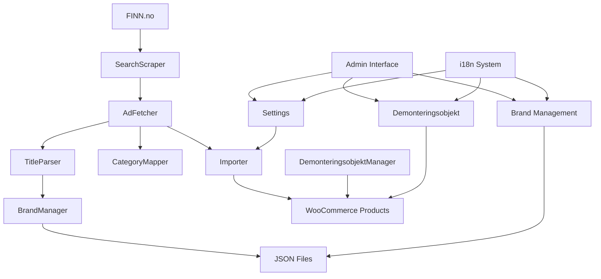
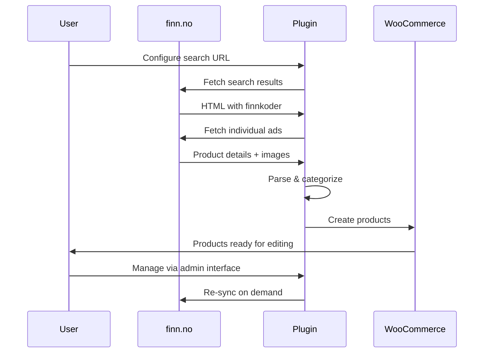
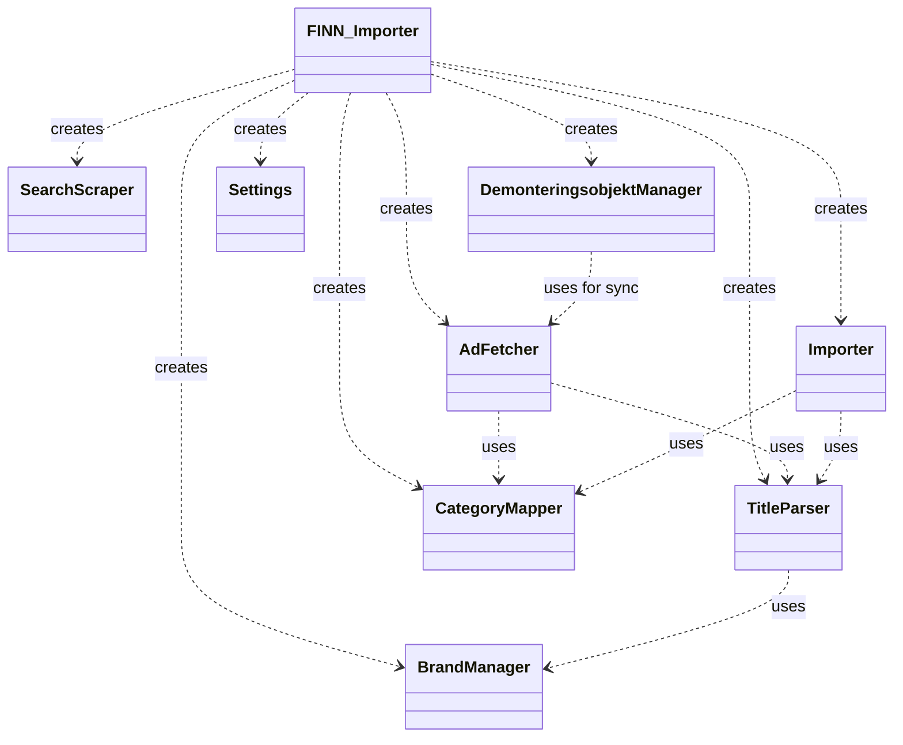

# FINN Importer for WooCommerce

A comprehensive WordPress plugin for importing motorcycle listings from finn.no into WooCommerce with specialized disassembly object management, condition tracking, and internationalization support.

**Author:** Christer Grevæg, Ekhana AS (ekhana.no)  
**Version:** 1.0.0  
**License:** GPL v2 or later  
**WordPress:** 5.0+  
**WooCommerce:** 5.0+  
**PHP:** 7.4+

## Quick Start

1. Run the packaging script: `.\build-plugin.ps1`
2. Upload the generated ZIP file to your WordPress site
3. Go to **Plugins > Add New > Upload Plugin**
4. Activate the **FINN Importer** plugin
5. Configure settings in **WooCommerce > FINN Importer**

## System Architecture



## Features

- **🚀 Automatic Imports**: Fetch motorcycle listings from finn.no with configurable search URLs
- **📊 Product Parsing**: Extract title, price, description, images, location, seller, and last modified date
- **🏷️ Smart Categorization**: Parse titles to extract motorcycle brand, model, and year into custom taxonomies
- **🗺️ Category Mapping**: Map FINN breadcrumbs to WooCommerce categories
- **📸 Image Galleries**: Download and set up WooCommerce product galleries from FINN images
- **📦 Draft Management**: Import as drafts for review, publish individually or in bulk
- **🔄 FINN Sync**: Re-sync products with latest FINN data (images, price, availability)
- **🚫 Auto Stock Management**: Automatically mark products as out-of-stock when no longer available on FINN
- **🏭 Disassembly Objects**: Specialized management for motorcycle parts with condition tracking
- **🎨 Condition Swatches**: Four-level condition system (Perfect/Green, Good/Yellow, Fair/Orange, Poor/Red) for individual parts
- **🌍 Internationalization**: Full Norwegian (nb_NO) and English (en_US) support with WordPress i18n
- **📋 Admin Documentation**: Direct access to README, CHANGELOG, and technical documentation
- **📦 Professional Packaging**: Windows build scripts with version management
- **🛠️ Developer Friendly**: Comprehensive documentation with mermaid diagrams and ERDs

## Data Flow



## Admin Interface

The plugin provides a comprehensive admin interface with three main sections:

### 1. Settings Page
- **Configuration**: Search URL, category mapping, rate limiting
- **Manual Import**: Trigger imports on demand
- **Product Management**: List all imported products with publish functionality
- **Documentation Links**: Direct access to README, CHANGELOG, and SPOT

### 2. Brand Management
- **Brand CRUD**: Add/remove motorcycle brands
- **Model Management**: Associate models with brands
- **JSON File Management**: Edit underlying brand/model data
- **Real-time Updates**: Changes affect title parsing immediately

### 3. Demonteringsobjekt Management
- **Product Table**: All WooCommerce products in editable table format
- **Inline Editing**: Edit km stand, condition, parts, and price without page reloads
- **Parts Modal**: Grid-based selection of motorcycle parts by category with condition swatches
- **Condition Mapping**: Four-level condition system (Perfect/Green, Good/Yellow, Fair/Orange, Poor/Red)
- **Individual Part Conditions**: Assign different condition levels to each selected part
- **FINN Sync**: Re-fetch product data and images from FINN
- **Tag Management**: Add categorization tags
- **Stock Management**: Automatic out-of-stock when products disappear from FINN

## Condition & Parts Mapping System

The plugin includes comprehensive mapping systems for motorcycle parts and conditions:

### Condition Mapping
- **Perfect**: Green (#28a745) - "Som ny" / Brand new
- **Good**: Yellow (#ffc107) - "Lett brukt" / Lightly used  
- **Fair**: Orange (#fd7e14) - "Brukt" / Used
- **Poor**: Red (#dc3545) - "Mye brukt/skadet" / Heavily used/damaged

### Parts Categories
Nine comprehensive categories with Norwegian and English labels:
- **Motor og drivverk**: Engine and drivetrain
- **Fjæring og styring**: Suspension and steering
- **Bremser**: Brakes
- **Hjul og dekk**: Wheels and tires
- **Ramme og chassis**: Frame and chassis
- **Karosseri og kåper**: Bodywork and fairings
- **Drivstoff og luft**: Fuel and air
- **Eksos og kjøling**: Exhaust and cooling
- **Elektronikk og belysning**: Electronics and lighting

### Mapping Features
- **Reverse Lookups**: Find category by part name
- **Condition Translation**: Map between labels, colors, and keys
- **Multi-language Support**: Norwegian and English part names
- **Structured Storage**: Consistent data format for parts and conditions

### Building Plugin Packages

Use the provided build scripts to create versioned ZIP packages for deployment:

```powershell
# PowerShell (recommended)
.\build-plugin.ps1                    # Uses version from VERSION.txt
.\build-plugin.ps1 -Version "1.1.0"   # Specific version
.\build-plugin.ps1 -NoTimestamp       # No timestamp in filename

# Batch file
build-plugin.bat
```

### Versioning

- Edit `VERSION.txt` to set your desired version number
- Or use automatic timestamp versioning (YY.MM.DD.HHMM format)
- Built packages are saved in the `build/` directory

See `PACKAGING.md` for detailed packaging instructions.

## Internationalization

The plugin supports full internationalization with Norwegian (nb_NO) and English (en_US) translations:

- **Admin Interface**: Automatically adapts to WordPress admin language setting
- **Motorcycle Terminology**: Proper Norwegian translations for bike parts and categories
- **User Messages**: All notifications and help text translated
- **Date/Currency**: Localized formatting where appropriate

## Installation

1. Upload the `finn-importer` folder to `wp-content/plugins/`
2. Activate the plugin in WordPress admin
3. Configure settings in WooCommerce > FINN Importer
4. Update CategoryMapper.php with actual WooCommerce category IDs for breadcrumb mapping
5. Run manual import or wait for scheduled runs

## Configuration

### Basic Setup
- **Search URL**: URL to FINN.no search results with your desired filters
- **Category ID**: WooCommerce category ID for imported products
- **Rate Limiting**: Delay between requests to avoid being blocked
- **User Agent**: Browser identification for FINN.no compatibility

### Advanced Configuration
- **Brand Management**: Add/remove motorcycle brands for title parsing
- **Model Association**: Link models to specific brands
- **Parts Categories**: Customize motorcycle part categories and conditions

## Usage

The plugin will automatically run hourly via WP-Cron. Use the "Run Import Now" button for manual execution.

Imported products appear as drafts in WooCommerce > Products.

Use the brand, model, and year filters in the admin product list to filter imported motorcycles.

### Disassembly Object Management

For products containing motorcycle parts:

1. Go to **WooCommerce > FINN Importer > Demonteringsobjekt**
2. View all products in table format
3. Click "Edit" to modify km stand, condition, and parts
4. Use "Select Parts" modal to choose available components
5. Assign condition levels (Perfect, Good, Fair, Poor) to individual parts
6. Click "Fetch" to sync with latest FINN data

## API Reference

### Custom Taxonomies
- `mc_brand`: Motorcycle brand (hierarchical)
- `mc_model`: Motorcycle model
- `mc_year`: Production year
- `mc_km_stand`: Mileage for disassembly objects
- `mc_tilstand`: Condition (Brukt/Ny)

### Custom Meta Fields
- `_ext_source`: 'finn' (source identifier)
- `_ext_id`: finnkode (unique SKU)
- `_ext_url`: FINN ad URL
- `_regular_price`: Product price
- `_stock`: Stock quantity
- `_stock_status`: Stock status
- `_product_image_gallery`: Image gallery IDs
- `_demont_km_stand`: Mileage
- `_demont_parts`: Parts list with conditions
- `_finn_last_modified`: Last sync timestamp
- `_finn_location`: Seller location
- `_finn_seller`: Seller information

## Technical Architecture

### Component Overview


### Database Schema


## Changelog

See [CHANGELOG.md](CHANGELOG.md) for detailed version history and updates.

## Contributing

1. Fork the repository
2. Create a feature branch
3. Make your changes
4. Update documentation and tests
5. Submit a pull request

## Support

For support and questions:
- **Author**: Christer Grevæg
- **Company**: Ekhana AS
- **Website**: [ekhana.no](https://ekhana.no)
- **Documentation**: See SPOT.md for technical details

## License

This plugin is licensed under the GPL v2 or later.

```
FINN Importer for WooCommerce
Copyright (C) 2025 Christer Grevæg, Ekhana AS

This program is free software; you can redistribute it and/or modify
it under the terms of the GNU General Public License as published by
the Free Software Foundation; either version 2 of the License, or
(at your option) any later version.

This program is distributed in the hope that it will be useful,
but WITHOUT ANY WARRANTY; without even the implied warranty of
MERCHANTABILITY or FITNESS FOR A PARTICULAR PURPOSE. See the
GNU General Public License for more details.
```
