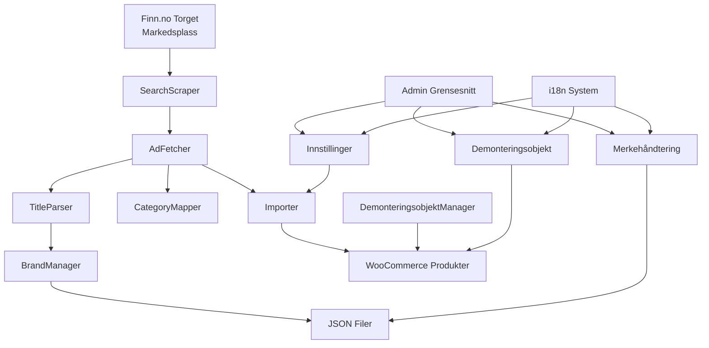
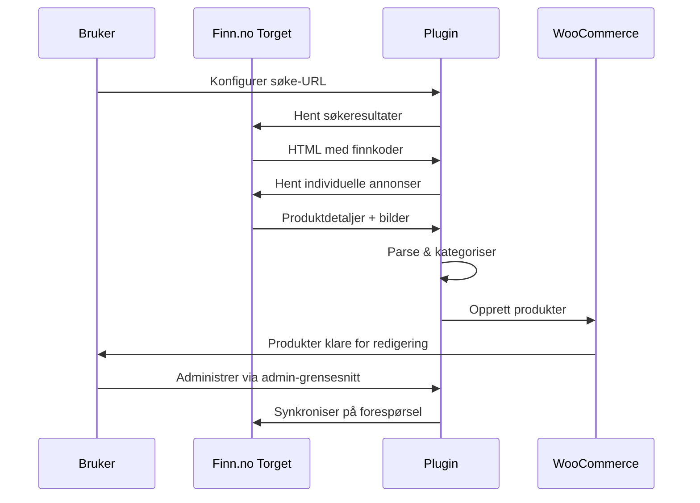
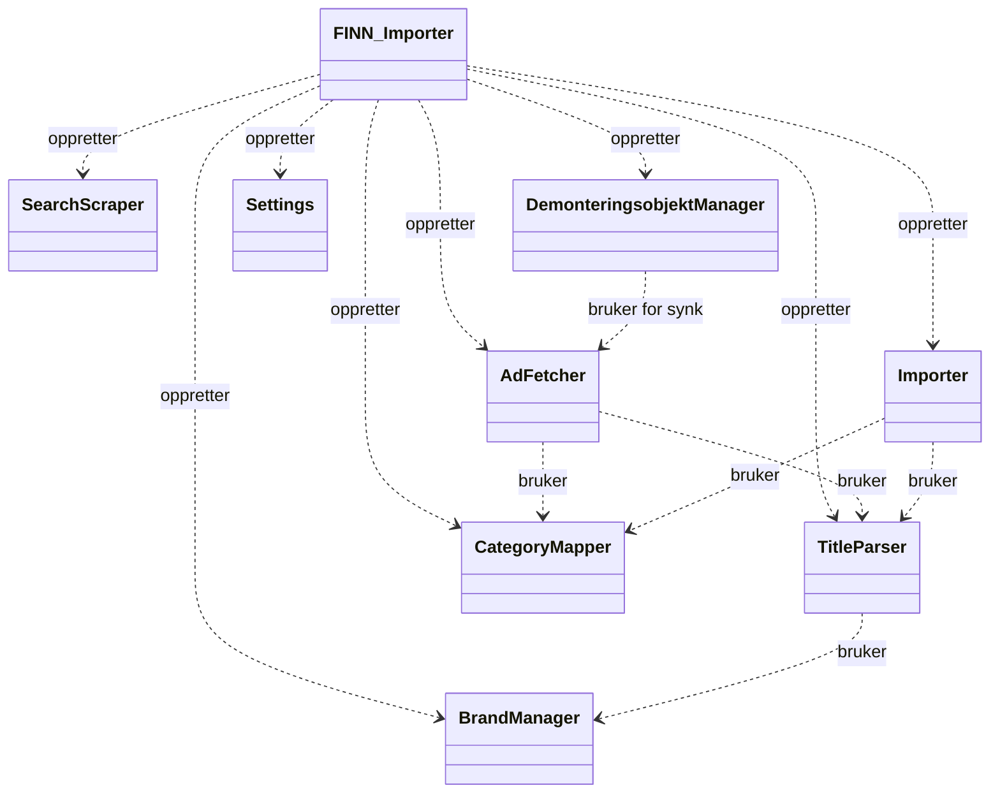
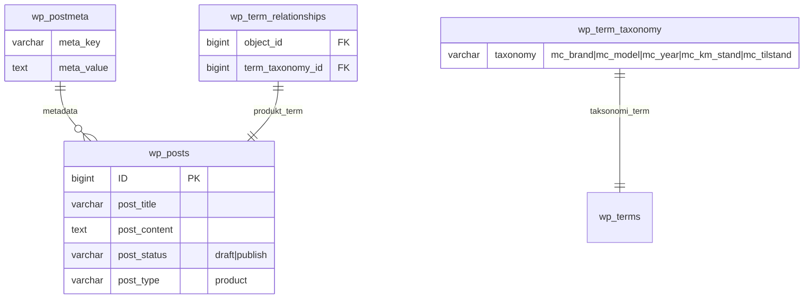

# FINN Importer for WooCommerce

En omfattende WordPress-plugin for å importere motorsykkellister fra **Finn.no Torget** (den norske markedsplassen) til WooCommerce med spesialisert demonteringsobjekt-håndtering, tilstandsporing og internasjonalisering.

**Forfatter:** Christer Grevæg, Ekhana AS (ekhana.no)  
**Versjon:** 1.0.0  
**Lisens:** GPL v2 eller senere  
**WordPress:** 5.0+  
**WooCommerce:** 5.0+  
**PHP:** 7.4+

## Hurtigstart

1. Kjør pakkeskriptet: `.\build-plugin.ps1`
2. Last opp den genererte ZIP-filen til WordPress-nettstedet ditt
3. Gå til **Plugins > Legg til ny > Last opp plugin**
4. Aktiver **FINN Importer**-pluginet
5. Konfigurer innstillinger i **WooCommerce > FINN Importer**

## Systemarkitektur



## Funksjoner

- **🚀 Automatiske Importer**: Hent motorsykkellister fra Finn.no Torget med konfigurerbare søke-URLer
- **📊 Produktparsing**: Trekk ut tittel, pris, beskrivelse, bilder, sted, selger og siste endringsdato
- **🏷️ Smart Kategorisering**: Parse titler for å trekke ut motorsykkelmerke, modell og år i egendefinerte taksonomier
- **🗺️ Kategorikartlegging**: Kartlegg FINN-brødsmuler til WooCommerce-kategorier
- **📸 Bildegallerier**: Last ned og sett opp WooCommerce-produktgallerier fra FINN-bilder
- **📦 Utkastshåndtering**: Importer som utkast for gjennomgang, publiser individuelt eller i bulk
- **🔄 FINN-synkronisering**: Synkroniser produkter med siste FINN-data (bilder, pris, tilgjengelighet)
- **🚫 Automatisk Lagerhåndtering**: Merk automatisk produkter som utsolgt når de ikke lenger er tilgjengelige på FINN
- **🏭 Demonteringsobjekter**: Spesialisert håndtering for motorsykkeldeler med tilstandsporing
- **🎨 Tilstandssvitsjer**: Fire-nivåers tilstandssystem (Perfekt/Grønn, Bra/Gul, Middels/Oransje, Dårlig/Rød) for individuelle deler
- **🌍 Internasjonalisering**: Full norsk (nb_NO) og engelsk (en_US) støtte med WordPress i18n
- **🎯 Forbedret UX**: Omfattende verktøytips, intuitivt grensesnitt med emojier og visuell tilbakemelding
- **📋 Admin-dokumentasjon**: Direkte tilgang til README, CHANGELOG og teknisk dokumentasjon
- **📦 Profesjonell Pakking**: Windows byggeskript med versjonshåndtering
- **🛠️ Utviklervennlig**: Omfattende dokumentasjon med mermaid-diagrammer og ERD-er

## Dataflyt



## Admin-grensesnitt

Pluginet gir et omfattende admin-grensesnitt med tre hovedseksjoner:

### 1. Innstillinger-side
- **Konfigurasjon**: Søke-URL, kategorikartlegging, rate-begrensning
- **Manuell Import**: Utløs importer på forespørsel
- **Produkthåndtering**: Liste alle importerte produkter med publiseringsfunksjonalitet
- **Dokumentasjonslenker**: Direkte tilgang til README, CHANGELOG og SPOT

### 2. Merkes håndtering
- **Merke CRUD**: Legg til/fjern motorsykkelmerker
- **Modellhåndtering**: Knytt modeller til merker
- **JSON-filhåndtering**: Rediger underliggende merke/modell-data
- **Sanntidsoppdateringer**: Endringer påvirker tittelparsing umiddelbart

### 3. Demonteringsobjekt håndtering
- **Produkttabell**: Alle WooCommerce-produkter klassifisert som "Demonteringsobjekt" (komplette sykler)
- **Inline-redigering**: Rediger km stand, tilstand, deler og pris uten sideinnlasting
- **Deler-modal**: Nettbasert utvalg av motorsykkeldeler etter kategori med tilstandssvitsjer
- **Tilstandskartlegging**: Fire-nivåers tilstandssystem (Perfekt/Grønn, Bra/Gul, Middels/Oransje, Dårlig/Rød)
- **Individuelle deltilstander**: Tildel forskjellige tilstandsnivåer til hver valgte del
- **FINN-synk**: Hent siste produktdata og bilder fra FINN
- **Tag-håndtering**: Legg til kategoriseringstagger
- **Lagerhåndtering**: Automatisk utsolgt når produkter forsvinner fra FINN

### 4. Deler håndtering
- **Produkttabell**: Alle WooCommerce-produkter klassifisert som "Deler" (individuelle deler)
- **Typebytte**: Nedtrekksmeny for å reklassifisere produkter mellom "Del" og "Demonteringsobjekt"
- **Inline-redigering**: Forenklet redigering for individuelle deler (tittel, pris)
- **FINN-synk**: Hent siste produktdata og bilder fra FINN
- **Lagerhåndtering**: Automatiske lagerstatusoppdateringer
- **Bulk-operasjoner**: Effektiv håndtering av individuelle komponenter

## Tilstand & Deler Kartleggingssystem

Pluginet inkluderer omfattende kartleggingssystemer for motorsykkeldeler og tilstander:

### Tilstandskartlegging
- **Perfekt**: Grønn (#28a745) - "Som ny" / Brand new
- **Bra**: Gul (#ffc107) - "Lett brukt" / Lightly used
- **Middels**: Oransje (#fd7e14) - "Brukt" / Used
- **Dårlig**: Rød (#dc3545) - "Mye brukt/skadet" / Heavily used/damaged

### Delerkategorier
Ni omfattende kategorier med norske og engelske etiketter:
- **Motor og drivverk**: Engine and drivetrain
- **Fjæring og styring**: Suspension and steering
- **Bremser**: Brakes
- **Hjul og dekk**: Wheels and tires
- **Ramme og chassis**: Frame and chassis
- **Karosseri og kåper**: Bodywork and fairings
- **Drivstoff og luft**: Fuel and air
- **Eksos og kjøling**: Exhaust and cooling
- **Elektronikk og belysning**: Electronics and lighting

### Tilstandssystem for Valgte Deler

#### Individuell Delt Tilstandstilordning
Hver motorsykkeldel kan ha sitt eget tilstandsnivå, noe som muliggjør detaljert lagerstyring:

1. **Velg Deler**: Velg deler fra den kategoriserte modalen
2. **Tilordne Tilstander**: Klikk tilstandssvitsjer ved siden av hver valgte del
3. **Visuell Tilbakemelding**: Valgte tilstander markeres med blå kant
4. **Standard Tilstand**: "Bra" (Bra) tildeles hvis ikke eksplisitt valgt

#### Tilstandssvitsj Grensesnitt
- **Fargekodede Sirkler**: Fire sirkelindikatorer per del (Grønn/Gul/Oransje/Rød)
- **Klikk for å Velge**: Klikk hvilken som helst svitsj for å tildele det tilstandsnivået
- **Enkelt Valg**: Kun én tilstand per del (radioknapp-atferd)
- **Validering**: Tilstander kan kun velges etter at del-checkbox er avmerket

#### Tilstand Legend
Modalen viser en legende som inneholder:
- **Tilstandsnavn**: Perfekt, Bra, Middels, Dårlig
- **Fargeindikator**: Visuell fargeprøve
- **Beskrivelse**: Norske forklaringer ("Som ny", "Lett brukt", etc.)
- **Tooltip-informasjon**: Hover viser detaljert beskrivelse

#### Datalagring Format
Deler med tilstander lagres som: `"Kategori|Delnavn:tilstand_nøkkel"`

**Eksempler:**
- `"Motor_og_drivverk|Motor komplett:perfekt"`
- `"Bremser|Bremsekaliper foran:middels"`
- `"Fjæring_og_styring|Forgaffel komplett:bra"`

#### Visuell Visning
Valgte deler vises med:
- **Tilstands Prikk**: Liten farget sirkel som indikerer tilstandsnivå
- **Delnavn**: Avkortet hvis for langt (hover for full navn)
- **Tag-format**: Ren, merkelapp-lignende utseende
- **Hover Tooltips**: Vis delnavn + tilstand beskrivelse

### Kartleggingsfunksjoner
- **Reversoppslag**: Finn kategori etter delnavn
- **Tilstand Oversettelse**: Kartlegg mellom etiketter, farger og nøkler
- **Flerspråklig Støtte**: Norske og engelske delnavn
- **Strukturert Lagring**: Konsistent dataformat for deler og tilstander

## Utvikling & Pakking

### Bygg Plugin Pakker

Bruk de medfølgende byggeskriptene for å lage versjonerte ZIP-pakker for distribusjon:

```powershell
# PowerShell (anbefalt)
.\build-plugin.ps1                    # Bruk versjon fra VERSION.txt
.\build-plugin.ps1 -Version "1.1.0"   # Spesifikk versjon
.\build-plugin.ps1 -NoTimestamp       # Ingen tidsstempel i filnavn

# Batch-fil
build-plugin.bat
```

### Versjonering

- Rediger `VERSION.txt` for å sette ønsket versjon
- Eller bruk automatisk tidsstempel-versjonering (ÅÅ.MM.DD.TTMM-format)
- Bygde pakker lagres i `build/`-mappen

### Kompiler Oversettelser

```powershell
# Kompiler .po filer til .mo filer (krever gettext-verktøy)
.\compile-translations.ps1
```

Se `PACKAGING.md` for detaljerte pakkingsinstruksjoner.

## Internasjonalisering

Pluginet støtter full internasjonalisering med norske (nb_NO) og engelske (en_US) oversettelser:

- **Admin-grensesnitt**: Tilpasses automatisk til WordPress admin-språkinnstilling
- **Motorsykkelterminologi**: Riktige norske oversettelser for sykkeldeler og kategorier
- **Brukermeldinger**: Alle varsler og hjelpetekst oversatt
- **Dato/Valuta**: Lokalisert formatering hvor aktuelt

## Installasjon

1. Last opp `finn-importer`-mappen til `wp-content/plugins/`
2. Aktiver pluginet i WordPress admin
3. Konfigurer innstillinger i WooCommerce > FINN Importer
4. Oppdater CategoryMapper.php med faktiske WooCommerce-kategori-IDer for brødsmulekartlegging
5. Kjør manuell import eller vent på planlagte kjøringer

## Konfigurasjon

### Grunnleggende Oppsett
- **Søke-URL**: URL til FINN.no søkeresultater med ønskede filtre
- **Kategori-ID**: WooCommerce produktkategori-ID hvor importerte motorsykler plasseres
- **Rate-begrensning**: Forsinkelse mellom forespørsler for å unngå blokkering
- **User Agent**: Nettleseridentifikasjonsstreng for FINN.no-kompatibilitet

### Avansert Konfigurasjon
- **Merkes håndtering**: Legg til/fjern motorsykkelmerker for tittelparsing
- **Modelltilknytning**: Knytt modeller til spesifikke merker
- **Delerkategorier**: Tilpass motorsykkeldelkategorier og tilstander

## Bruk

Pluginet kjører automatisk hver time via WP-Cron. Bruk "Kjør Import Nå"-knappen for manuell kjøring.

Importerte produkter vises som utkast i WooCommerce > Produkter.

Bruk merke-, modell- og år-filtrene i admin-produktlisten for å filtrere importerte motorsykler.

### Demonteringsobjekt Håndtering

For produkter som inneholder motorsykkeldeler:

1. Gå til **WooCommerce > FINN Importer > Demonteringsobjekt**
2. Se alle produkter i tabellformat
3. Klikk "Rediger" for å endre km stand, tilstand og deler
4. Bruk "Velg Deler"-modal for å velge tilgjengelige komponenter
5. Tildel tilstandsnivåer (Perfekt, Bra, Middels, Dårlig) til hver valgte del
6. Klikk "Hent" for å synkronisere med siste FINN-data

## API Referanse

### Egendefinerte Taksonomier
- `mc_brand`: Motorsykkelmerke (hierarkisk)
- `mc_model`: Motorsykkelmodell
- `mc_year`: Produksjonsår
- `mc_km_stand`: Kilometerstand for demonteringsobjekter
- `mc_tilstand`: Tilstand (Brukt/Ny)

### Egendefinerte Meta-felt
- `_ext_source`: 'finn' (kildeidentifikator)
- `_ext_id`: finnkode (unik SKU)
- `_ext_url`: FINN annonse-URL
- `_regular_price`: Produktpris
- `_stock`: Lagermengde
- `_stock_status`: Lagerstatus
- `_product_image_gallery`: Bildegalleri-IDer
- `_demont_km_stand`: Kilometerstand
- `_demont_parts`: Delerliste med tilstander
- `_finn_last_modified`: Siste synkronisering tidsstempel
- `_finn_location`: Selgersted
- `_finn_seller`: Selgerinformasjon

## Teknisk Arkitektur

### Komponentoversikt


### Databaseskjema


## Changelog

Se [CHANGELOG.md](CHANGELOG.md) for detaljerte versjonshistorikk og oppdateringer.

## Bidrag

1. Fork repository
2. Opprett en feature-branch
3. Gjør endringene dine
4. Oppdater dokumentasjon og tester
5. Send en pull request

## Støtte

For støtte og spørsmål:
- **Forfatter**: Christer Grevæg
- **Selskap**: Ekhana AS
- **Nettside**: [ekhana.no](https://ekhana.no)
- **Dokumentasjon**: Se SPOT.md for tekniske detaljer

## Lisens

Dette pluginet er lisensiert under GPL v2 eller senere.

```
FINN Importer for WooCommerce
Copyright (C) 2025 Christer Grevæg, Ekhana AS

Dette programmet er gratis programvare; du kan redistribuere det og/eller
modifisere det under vilkårene i GNU General Public License som publisert av
Free Software Foundation; enten versjon 2 av lisensen, eller
(etter eget valg) enhver senere versjon.

Dette programmet distribueres i håp om at det vil være nyttig,
men UTEN NOEN GARANTI; selv uten underforstått garanti for
SALGBARHET eller EGNETHET FOR ET BESTEMT FORMÅL. Se GNU
General Public License for flere detaljer.
```
